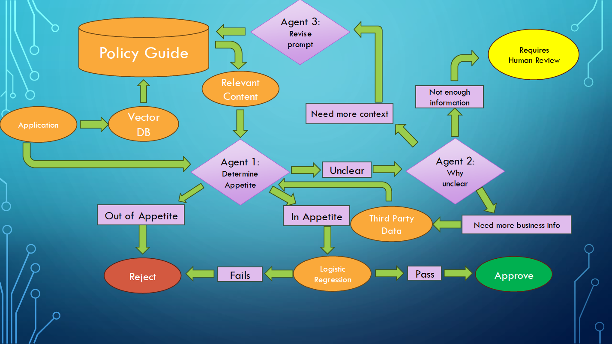

#  Agentic AI Evaluation Pipeline for Straight-Through Underwriting

This project explores the use of **Agentic Retrieval-Augmented Generation (RAG)** systems to automate insurance underwriting workflows.  It includes multi-agent workflows and LLM reasoning.
It was developed as part of a research grant from the **Casualty Actuarial Society (CAS)** in collaboration with **Brigham Young University**.

---

## Overview
Traditional LLMs can summarize or classify text but struggle with multi-step decision logic.  
This project introduces an **Agentic AI architecture** that integrates reflection, routing, and retrieval—allowing large language models to:
- Check underwriting applications against guideline text,
- Retrieve additional context or third-party data when uncertain,
- Escalate complex cases for review,
- Execute a final logistic regression decision for acceptance or rejection.

 The full workflow looks like this:
 

and I gave more details at the Actuarial Research Conference using these [slides](./ARC2025_Robert_Richardson.pdf).

---

##  Architecture

| Component | Description |
|------------|--------------|
| **Agent 1 — Guideline Evaluator** | Compares applications to the underwriting guidebook. Routes clear cases directly to decision logic. |
| **Agent 2 — Context Router** | Determines whether missing information is due to unclear guidelines or missing business data. |
| **Agent 3 — Reflection Agent** | Reformulates prompts for additional context from the guidebook or external sources. |
| **Logistic Model** | Makes the final decision based on structured variables once agents agree on the context. |

The orchestration is implemented in **LangChain** and **LangGraph**, with storage via **Vector DB** (FAISS or Chroma).

---

## ⚙️ Technical Stack
- **Python**, **LangChain**, **LangGraph**
- **OpenAI / Anthropic API** (LLM inference)
- **AWS Lambda** for orchestration and evaluation
- **Vector DB** for document retrieval
- **Scikit-learn** for logistic regression
- **NumPy / Pandas / JSON** for data pipelines

---

## 📊 Experimental Design

Each underwriting application is tested across **five structured scenarios**:
1.  **Guidebook-compliant (should accept)**
2.  **Single issue out of appetite (should reject)**
3.  **Logistic failure (should reject)**
4.  **Missing info recoverable via third-party data (should reject)**
5.  **Missing info unrecoverable (should refer to human review)**

Model outputs are evaluated for both:
- **Decision accuracy**
- **Reason alignment** via cosine similarity to expected rejection rationale.

Results show:
| Model | Accuracy | Cosine Similarity |
|--------|-----------|------------------|
| Agentic RAG | **Highest** | 21% |
| Naïve RAG | Moderate | 15% |
| LLM-Only | Baseline | 11% |

---

##  Key Insights
- Agentic RAG pipelines outperform both naïve RAG and non-retrieval LLMs.
- Reflection and routing loops allow multi-agent systems to self-correct.
- Evaluation pipelines can generalize to other regulated domains (finance, healthcare).

---

##  Future Work
- Complete human validation of generated applications  
- Test alternative retrieval strategies and model families  
- Release open dataset for benchmarking agentic orchestration frameworks  

---

## 📬 Contact
**Robert Richardson, PhD, ASA**  
Brigham Young University  
📧 [richardson@stat.byu.edu](mailto:richardson@stat.byu.edu)  
🔗 [LinkedIn](https://www.linkedin.com/in/robert-richardson-a0597a174/)

